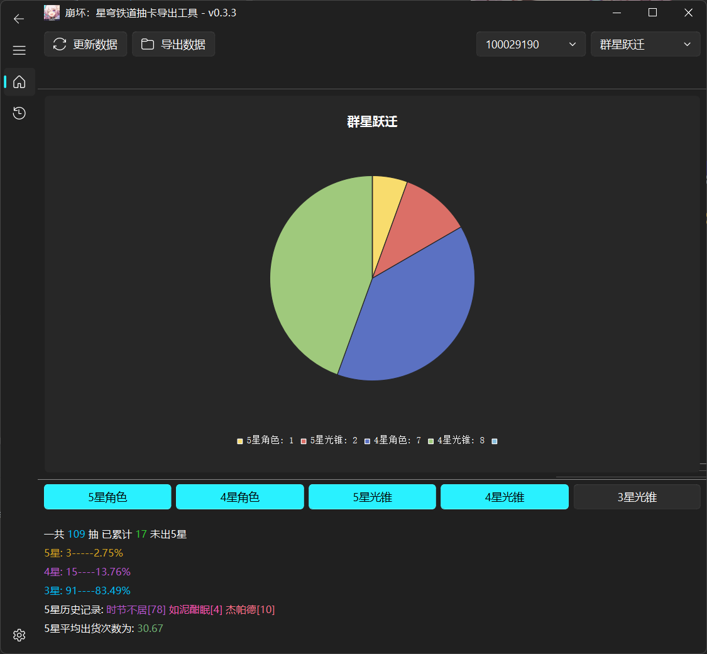

  

<h1 align="center">崩坏：星穹铁道抽卡导出工具</h1>

<h3 align="center">
  <a href="README.MD">English</a> | 简体中文
</h3>

<h3 align="center">
  ✨ 基于 <a href="https://www.python.org/">Python 3.10</a> 和 <a href="https://pypi.org/project/PyQt5/">PyQt5</a> 编写的工具 ✨
</h3>

  
  
  
  

## 丨简介

一个用于导出 [崩坏：星穹铁道](https://sr.mihoyo.com/) 抽卡记录的小工具。

## 丨功能列表

- 从游戏中导出抽卡记录
- 从记录中绘制饼图分析记录
- 导出记录为 Excel 表格
- 导出原始记录为 JSON 文件
- 内置的抽卡记录分析器，快速帮你分析你的记录，以及你的已垫抽数。

软件截图

## 丨 使用方法

从 [Release](https://github.com/DancingSnow0517/StarRail-gacha/releases) 页面下载最新版本的压缩包，解压后运行 `StarRail Gacha Exporter.exe` 即可。

打开游戏的跃迁历史记录，点击左上角的 `导出数据` 按钮，软件会自动的将最近 6 个月的所有数据导出来。

## 丨 维护者

[@DancingSnow0517](https://github.com/DancingSnow0517)

## 丨 本地化

现在软件支持多个语言，但是目前只有简体中文和英语，其他的大多为机翻。

如果你想来改进我们的翻译，欢迎来到 [Crowdin](https://crowdin.com/project/StarRail-gacha) 为我们翻译。

## 丨 如何贡献

非常欢迎你的加入！[提一个 Issue](https://github.com/DancingSnow0517/StarRail-gacha/issues/new) 或者提交一个 Pull Request。

崩坏：星穹铁道抽卡导出工具遵循 [Contributor Covenant](http://contributor-covenant.org/version/1/3/0/) 行为规范。

## 丨 使用许可

[MIT](LICENSE) © DancingSnow0517

