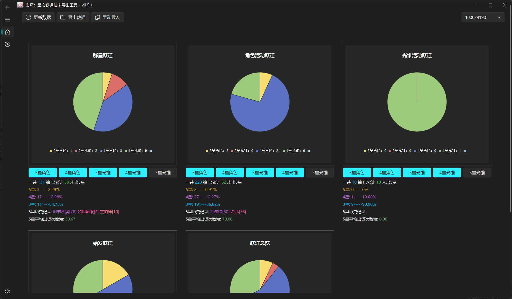

  

<h1 align="center">StarRail Gacha Exporter</h1>

<h3 align="center">
    English | <a href="README-CN.MD">简体中文</a>
</h3>

<h3 align="center">
  ✨ Tools written based on <a href="https://www.python.org/">Python 3.10</a> and <a href="https://pypi.org/project/PyQt5/">PyQt5</a> ✨
</h3>

  
  
  
  

## 丨Introduction

A tool for exporting gacha records from [Honkai: StarRail](https://hsr.hoyoverse.com/en-us/).

## 丨Features

- Export gacha records from the game
- Draw pie chart from the records
- Export records to Excel table
- Export raw records to JSON file
- Built-in gacha record analyzer, which can help you analyze your records.

Screenshot

## 丨 Usage

From [Release](https://github.com/DancingSnow0517/StarRail-gacha/releases) download the latest version of the compressed package on the page, Run after decompression `StarRail Gacha Exporter.exe`.

Open the game warp history, and then click `Export Data` button in the software, the software will automatically export the data.

## 丨 Maintainer

[@DancingSnow0517](https://github.com/DancingSnow0517)

## 丨 Localization

Currently, the software supports multiple languages, but currently only Simplified Chinese and English are available, with most of the others being machine translated.

If you want to improve our translation, welcome to [Crowdin](https://crowdin.com/project/StarRail-gacha) to translate for us.

## 丨 Contributing

We welcome you to join us! [Create an Issue](https://github.com/DancingSnow0517/StarRail-gacha/issues/new) or create a Pull Request.

Honkai: StarRail Gacha Exporter follows the [Contributor Covenant](http://contributor-covenant.org/version/1/3/0/) Code of Conduct.

## 丨 License

[MIT](LICENSE) © DancingSnow0517

